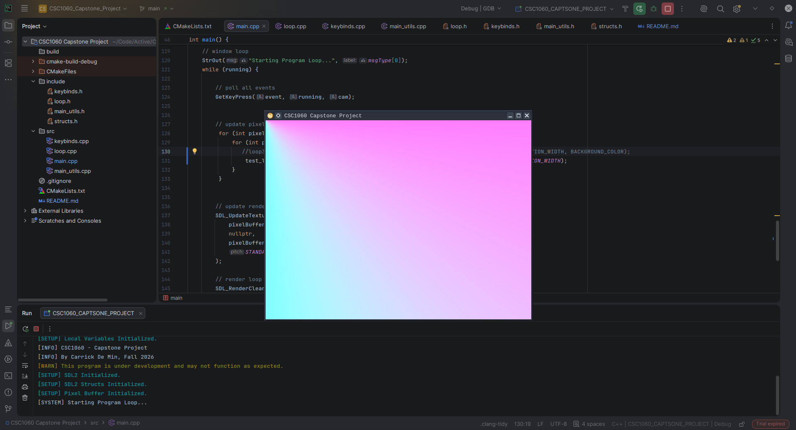

# CSC1060 Capstone - Black Hole Sim

A (not quite) real-time visual simulation of a Black Hole, including Doppler Effect, Gravitational Lensing, Accretion Disk, and Halo.

CPU traced representation of light rays passing through a black hole in space.
 - C++ Calculates light rays, star position and black hole effects
 - Each pixel gets an RBG value in a pixel buffer
 - SDL2 renders pixel buffer to screen using GPU

## Run/Install (Linux or Windows)

This project has cross-platform compatible makefiles for Linux and Windows x86.

To install and run, simply download or clone this repository, navigate to ./build and run the linux application file or build from source.
- **Linux**
- ./CSC1060_Captstone_Project/build
- Find ./CSC1060_CAPSTONE_PROJECT
- Execute via file manager or terminal

- **Windows**
- to come ig

You can use the following commands to simplify the install if you are on linux to install the latest git push from main:

(Ensure that you have git and base-devel intalled, as well as cmake and a cpp compiler)

~~~bash
git clone https://github.com/cloverless08/black-hole-simulation.git
cd CSC1060-Capstone-Project
rm -rf ./build/
cmake -S . -B build
cd ./build && make && cd ..
cp ./build/CSC1060_CAPSTONE_PROJECT .
~~~

***OR***

Download the cross-platform executable here (without source code):
 - [Google Drive](link TK)
 - [Dropbox](link TK)

## Controls/Keybinds
- Arrow Keys: Conrol camera pitch and yaw
- D: Print diagnostic info to terminal/screen
- S: Save snapshot of current frame
- P: Pause simulation

## Authors

Carrick De Min:
- Github [@cloverless08](https://www.github.com/cloverless08)
- Instagram [@carrick.ature](https://www.instagram.com/carrick.ature)

## AI Use Disclaimer
As is standard convention in my projects, and to uphold my education
and academic honesty, *no generative AI tools (such as ChatGPT or Claude Code)
were used to write, generate, or create any code or other submitted project content.*

AI tools played a minor role in compiling research resources
and articles and were used as personal tutoring resources to explain certain
C++ and programming concepts while I was learning them. 
Any resulting knowledge was independently applied and implemented by me.

AI use in this project aligns with the 
FRCC Code of Conduct and the requirements outlined in the CSC1060 syllabus.

Please refer to the tags in the **Sources** section of this readme for more specifics.

## License

~~~ Synopsis
Permission is hereby granted, free of charge, to any person obtaining a copy
of this software and associated documentation files (the "Software"), to deal
in the Software without restriction, including without limitation the rights
to use, copy, modify, merge, publish, distribute, sublicense, and/or sell
copies of the Software, and to permit persons to whom the Software is
furnished to do so, subject to the following conditions:
~~~

[MIT](https://choosealicense.com/licenses/mit/)

## Screenshots

⠀⠀⠀⠀⠀⠀⠀⠀⠀⠀⠀⠀⠀⠀⠀⠀⠀⠀⠀⠀⠀⠀⠀⠀⠀⠀⠀⠀⠀⠀⠀⠀⠀⠀⠀⠀⠀⠀⠀⠀⠀⠀⡀⠀⠀⠀⠀⠀⠀⠀⠀⠀⠀⠀⠀⠀⠀⠀⠀⠀⠀⠀⠀⠀⠀⠀⠀⠀⠀
⠀⠀⠀⠀⠀⠀⠀⠀⠀⠀⠀⠀⠀⠀⠀⠀⠀⠀⠀⠀⠀⠀⠀⠀⠀⠀⠀⠀⠀⠀⠀⠀⠀⠀⠈⠀⠀⠀⠀⠀⠀⠀⠀⠀⠀⠀⠀⠀⠀⠀⠀⠀⠀⠀⠀⠀⠀⠀⠀⠀⠀⠀⠀⠀⠀⠀⠀⠀⠀
⠀⠀⠀⠀⠀⠀⠀⠀⠀⠀⠀⠀⠀⠀⠀⠀⠀⠀⠀⠀⠀⠀⠀⠀⠀⠖⠃⠀⠀⠀⡁⠀⠀⠀⠀⠀⠐⠆⠀⠀⠀⠀⠀⠀⠁⠀⠀⠀⠀⠀⠀⠀⠀⠀⠀⠀⠀⠀⠀⡠⢔⡤⠊⠁⠀⠀⠀⠀⠀
⠀⠀⠀⠀⠀⠀⠀⠀⠀⠀⠀⠀⠀⠀⠀⠀⠀⠀⠁⠀⠀⠀⠁⠀⠀⠘⠁⢀⠀⠀⠀⠀⢈⠓⠂⠠⡄⠀⠈⠀⠀⠀⠀⠀⠀⠀⠀⠀⠀⠀⠀⠀⠀⢀⣠⣶⠿⠞⠋⠁⠀⠀⠀⠀⠀⠀⠀⠀⠀
⠀⠀⠀⠀⠀⠀⠀⠀⠀⠀⠀⠀⠀⠀⠀⠀⠀⠀⠀⠀⠀⠒⠁⠀⠠⡚⠁⢀⣙⣀⣈⡩⠬⢁⠀⢑⠶⠤⡆⠤⡀⠀⠀⠀⠀⠀⠀⢀⠴⢲⣋⣽⣷⠟⠃⠀⠀⠀⠀⠀⠀⠀⠀⠀⠀⠀⠀⠀⠀
⠀⠀⠀⠀⠀⠀⠀⠀⠀⠀⠀⠀⠀⠀⠀⠀⠁⠀⢠⠀⠀⣶⠃⠗⣡⣶⣮⣿⡿⠿⠿⢿⣿⣷⣶⣤⣤⠤⠴⠦⠬⣤⣤⠄⣉⠉⠝⢲⣿⡷⠻⠂⠀⠀⠀⠀⠀⠀⠀⠀⠀⠀⠀⠀⠀⠀⠀⠀⠀
⠀⠀⠀⠀⠀⠀⠀⠀⠀⠀⠀⠀⠀⠈⠀⠀⠀⠀⠁⡀⡸⠁⣰⣿⡿⠛⠋⣁⡀⠤⠤⢄⡀⠈⠛⢯⣿⣟⣾⣶⣶⣮⣭⣵⣾⣿⣟⠿⠉⢨⠖⠃⠀⠀⠀⠀⠀⠀⠀⠀⠀⠀⠀⠀⠀⠀⠀⠀⠀
⠀⠀⠀⠀⠀⠀⠀⠀⠀⠀⠀⠀⠀⠀⠀⠀⢠⠀⢠⠳⡧⣻⡿⠋⢀⠒⠉⠀⠀⠀⠀⠀⠀⠉⠢⠀⠀⠙⠛⣻⣿⣿⣿⢿⣿⣿⠟⡱⠖⠊⠁⠀⠀⠀⠀⠀⠀⠀⠀⠀⠀⠀⠀⠀⠀⠀⠀⠀⠀
⠀⠀⠀⠀⠀⠀⠀⠀⠀⠀⠀⠀⠀⠀⠀⠀⠁⢠⣧⠓⣾⣿⠁⠀⠃⠀⠀⠀⠀⠀⠀⠀⠀⠀⠀⠉⢦⣠⣾⣿⠿⣿⣿⣿⡿⣫⠏⠁⠀⠀⠀⠀⠀⠀⠀⠀⠀⠀⠀⠀⠀⠀⠀⠀⠀⠀⠀⠀⠀
⠀⠀⠀⠀⠀⠀⠀⠀⠀⠀⠀⠀⠀⠀⠀⡀⠀⠂⢃⣸⣿⠇⢠⠃⠀⠀⠀⠀⠀⠀⠀⠀⠀⢀⣠⣴⣿⠟⢿⠁⠸⡿⣿⣯⡶⠃⠀⠀⠀⠀⠀⠀⠀⠀⠀⠀⠀⠀⠀⠀⠀⠀⠀⠀⠀⠀⠀⠀⠀
⠀⠀⠀⠀⠀⠀⠀⠀⠀⠀⠀⠀⠀⠀⠀⠁⢘⡄⠘⣿⣿⠀⠸⡀⠀⠀⠀⠀⠀⢀⣀⣴⣾⣿⡿⡟⡋⠐⡇⠀⢸⣿⣿⠃⠀⠁⠀⠀⠀⠀⠀⠀⠀⠀⠀⠀⠀⠀⠀⠀⠀⠀⠀⠀⠀⠀⠀⠀⠀
⠀⠀⠀⠀⠀⠀⠀⠀⠀⠀⠀⠀⠀⠀⠀⠀⢡⠘⢰⣿⡿⡆⠀⣇⠀⣀⣠⣤⣶⣿⢷⢟⠻⠀⠈⠀⠀⠀⡇⠀⣼⣿⣿⠂⠀⡀⠀⠀⠀⠀⠀⠀⠀⠀⠀⠀⠀⠀⠀⠀⠀⠀⠀⠀⠀⠀⠀⠀⠀
⠀⠀⠀⠀⠀⠀⠀⠀⠀⠀⠀⠀⠀⢀⠔⢀⡴⢯⣾⠟⡏⢀⣠⣿⣿⣿⣟⢟⡋⠅⠘⠉⠀⠀⠀⠀⢀⠀⠁⢠⣿⣟⠃⠀⠁⠀⠀⠀⠀⠀⠀⠀⠀⠀⠀⠀⠀⠀⠀⠀⠀⠀⠀⠀⠀⠀⠀⠀⠀
⠀⠀⠀⠀⠀⠀⠀⠀⠀⠀⠀⠀⠀⢠⠞⣻⣷⡿⢙⣩⣶⡿⠿⠛⠉⠑⢡⡁⠀⠀⠀⠀⠀⠀⢀⠔⠁⠀⣰⣿⣿⡟⠀⠀⠀⠀⠀⠀⠀⠀⠀⠀⠀⠀⠀⠀⠀⠀⠀⠀⠀⠀⠀⠀⠀⠀⠀⠀⠀
⠀⠀⠀⠀⠀⠀⠀⠀⠀⠀⠀⣡⣾⣥⣾⢫⡦⠾⠛⠙⠉⠀⠀⢀⣀⠀⠈⠙⠓⠦⠤⠤⠀⠘⠁⢀⡤⣾⡿⠏⠁⠀⠀⠀⠀⠀⠀⠀⠀⠀⠀⠀⠀⠀⠀⠀⠀⠀⠀⠀⠀⠀⠀⠀⠀⠀⠀⠀⠀
⠀⠀⠀⠀⠀⠀⠀⠀⠔⣴⣾⣿⣿⢟⢝⠢⠃⢀⣤⢴⣾⣮⣷⣶⢿⣶⡤⣐⡀⠀⣠⣤⢶⣪⣿⣿⡿⠟⠀⠀⠀⠀⠀⠀⠀⠀⠀⠀⠀⠀⠀⠀⠀⠀⠀⠀⠀⠀⠀⠀⠀⠀⠀⠀⠀⠀⠀⠀⠀
⠀⠀⠀⠀⠀⠀⡀⣦⣾⡿⡛⠵⠺⢈⡠⠶⠿⠥⠥⡭⠉⠉⢱⡛⠻⠿⣿⣿⣿⣿⣿⠿⠿⠿⠟⠭⠛⠂⠀⠀⠀⠀⠀⠀⠀⠀⠀⠀⠀⠀⠀⠀⠀⠀⠀⠀⠀⠀⠀⠀⠀⠀⠀⠀⠀⠀⠀⠀⠀
⠀⠀⠀⢀⢴⠕⣋⠝⠕⠐⠀⠔⠉⠀⠀⠀⠀⠁⠀⠀⠀⠀⠀⠀⠀⠀⠀⠉⠁⠉⠁⠁⠁⠁⠈⠀⠁⠀⠀⠀⠀⠀⠀⠀⠀⠀⠀⠀⠀⠀⠀⠀⠀⠀⠀⠀⠀⠀⠀⠀⠀⠀⠀⠀⠀⠀⠀⠀⠀
⢀⣠⠁⠈⠀⠀⠀⠀⠀⠀⠀⠀⠀⠀⠀⠀⠀⠀⠀⠀⠀⠀⠀⠀⠀⠀⠀⠀⠀⠀⠀⠀⠀⠀⠀⠀⠀⠀⠀⠀⠀⠀⠀⠀⠀⠀⠀⠀⠀⠀⠀⠀⠀⠀⠀⠀⠀⠀⠀⠀⠀⠀⠀⠀⠀⠀⠀⠀⠀
⠀⠀⠀⠀⠀⠀⠀⠀⠀⠀⠀⠀⠀⠀⠀⠀⠀⠀⠀⠀⠀⠀⠀⠀⠀⠀⠀⠀⠀⠀⠀⠀⠀⠀⠀⠀⠀⠀⠀⠀⠀⠀⠀⠀⠀⠀⠀⠀⠀⠀⠀⠀⠀⠀⠀⠀⠀⠀⠀⠀⠀⠀⠀⠀⠀⠀⠀⠀⠀
⠀⠀⠀⠀⠀⠀⠀⠀⠀⠀⠀⠀⠀⠀⠀⠀⠀⠀⠀⠀⠀⠀⠀⠀⠀⠀⠀⠀⠀⠀⠀⠀⠀⠀⠀⠀⠀⠀⠀⠀⠀⠀⠀⠀⠀⠀⠀⠀⠀⠀⠀⠀⠀⠀⠀⠀⠀⠀⠀⠀⠀⠀⠀⠀⠀⠀⠀⠀⠀

## Sources

